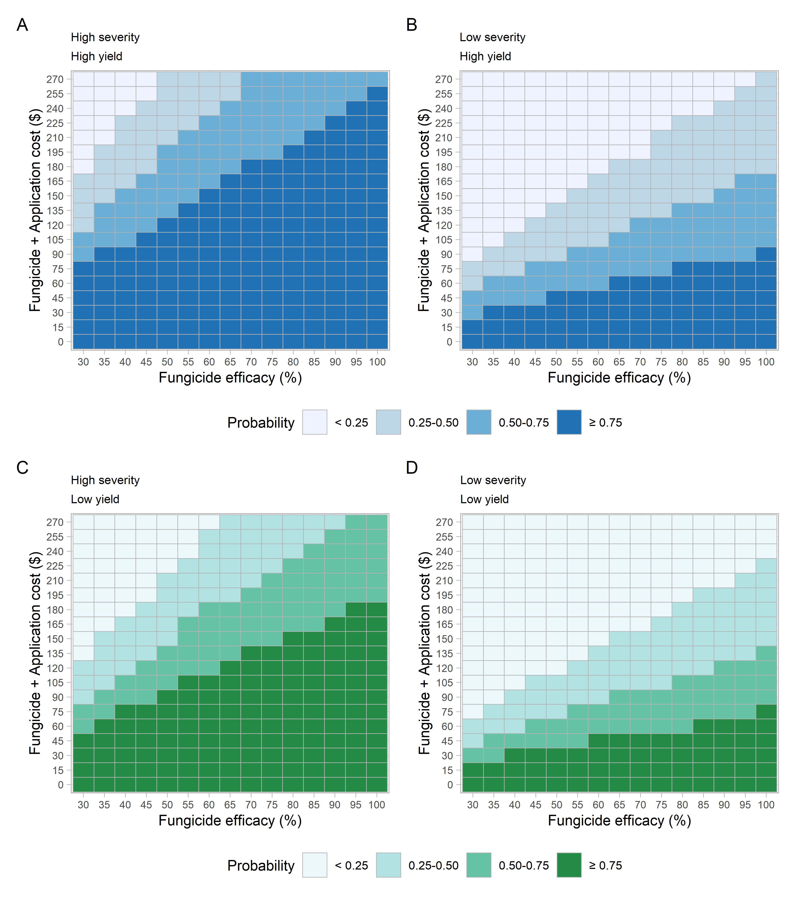

% About

 In this website are available the codes used to reproduce the analysis and results of the research conducted by a D.sc student Kaique dos S. Alves under the supervision of Prof. Emerson Del Ponte, Universidade Federal de Vicosa, MG, Brazil.

 In this study a Monte Carlo simulation framework was developed to calculate profitability depending on the fungicide program's efficacy and total cost for soybean rust management in Brazil.  
  
   

## Citation

Alves, K. S., Barro, J. P., Silva, M. G., & Del Ponte, E. M. (2021, January 20). Profitability of fungicide applications for managing soybean rust in scenarios of variable efficacy and costs: a stochastic simulation. https://doi.org/10.17605/OSF.IO/CE8H5
 

